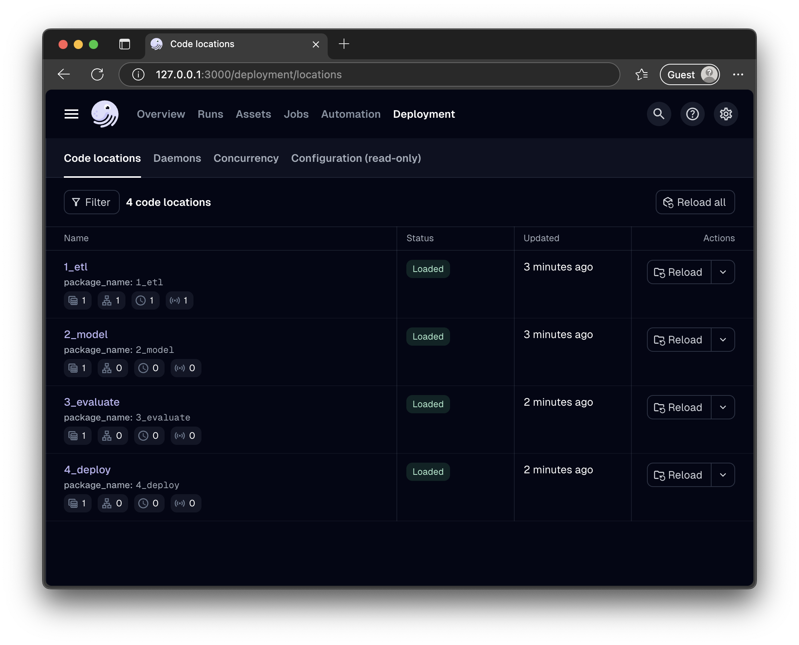

# Dagster ML Multi-Code-Location Template

**This repository is a GitHub Template for building modular, production-grade ML/data pipelines with [Dagster](https://dagster.io) using a multi-code-location architecture.**

- **Mono-repo default:** This template assumes a mono-repo structure, but you can adapt it for a multi-repo setup (see below)
- **To use:** Click "Use this template" on GitHub, then customize code location names, project name, and assets as needed

> **Note:** this is a work-in-progress template as I learn the Dagster framework. I've open-sourced this to gain feedback. Please feel free to create Issues and Pull Requests to improve this template. Thank you.

## Table of Contents

- [Overview](#overview)
- [Project Structure](#project-structure)
- [Using This Template](#using-this-template)
- [Code Location Purposes](#code-location-purposes)
- [Mono-Repo vs Multi-Repo](#mono-repo-vs-multi-repo)
- [Quickstart with Python CLI (Recommended)](#quickstart-with-python-cli-recommended)
- [Example Pipeline Flow](#example-pipeline-flow)
- [Dagster Concepts Demoed](#dagster-concepts-demoed)
- [References](#references)

## Overview

This template demonstrates a modular Dagster project with each pipeline stage isolated in its own Python environment. The structure enables clear dependency management and scalable development. The example model is a decode-only Transformer, but you can adapt it for any ML/data workflow.

For more on Dagster concepts, see the [Dagster Documentation](https://docs.dagster.io).

## Project Structure

- **/dagster_cloud.yaml**: Defines Dagster code locations for deployment ([docs](https://docs.dagster.io/concepts/code-locations#code-locations))
- **/workspace.yaml**: Configures local Dagster workspace and code location loading ([docs](https://docs.dagster.io/concepts/code-locations/workspaces))
- **/shared_code_location/**: Shared Python code (utilities, tokenization, I/O) importable by all code locations
- **/example_input_files_resource/**: Example input data for the pipeline
- **/example_output_resources/**: Example output data for the pipeline
- **/1_etl_code_location/**: Data ingestion, tokenization, vocabulary extraction, and splitting (ETL pipeline)
  - **1_etl/1_ingest/**: Data ingestion assets (uses Dagster resource for raw data)
  - **1_etl/2_tokenize/**: Tokenization assets
  - **1_etl/3_split_data/**: Data splitting assets
  - **1_etl/4_vocab_from_train_data/**: Vocabulary extraction from train split
- **/2_model_code_location/**: Model definition and training
- **/3_evaluate_code_location/**: Model evaluation and metrics
- **/4_deploy_code_location/**: Model deployment, packaging, and serving (outputs to example_output_resources via resource)

Each code location contains:

- `assets.py`: Dagster assets for the location
- `definitions.py`: Dagster Definitions object for repository registration
- `requirements.txt`, `setup.py`, `pyproject.toml`, `setup.cfg`: Python packaging and dependencies

## Using This Template

1. **Click "Use this template" on GitHub.**
2. **Rename code locations and packages** as needed (e.g., `1_etl_code_location` → `my_etl_code_location`, `1_etl` → `my_etl`).
3. **Edit assets and definitions** in each code location to fit your workflow.
4. **Update `workspace.yaml` and `dagster_cloud.yaml`** to match your code location names and structure.
5. **(Optional) Split into multiple repos:** See below for multi-repo setup instructions.

## Quickstart with Python CLI (Recommended)

A Python-based CLI is provided in `scripts/cli.py` to automate setup and common project tasks. The most common commands are:

- `python scripts/cli.py setup` — Set up all Python environments and install dependencies ([Dagster installation docs](https://docs.dagster.io/getting-started/installation))
- `python scripts/cli.py clean` — Remove all virtual environments and Python caches
- `python scripts/cli.py dev` — Start the Dagster dev webserver for the whole project
- `python scripts/cli.py dev <location>` — Start the dev webserver for a single code location (e.g., `python scripts/cli.py dev 1_etl_code_location`)
- `python scripts/cli.py test` — Run tests in all code locations
- `python scripts/cli.py --help` — Show help and list available commands and options

### Example usage

```sh
python scripts/cli.py setup
source .venv/bin/activate
python scripts/cli.py dev  # Loads all code locations as defined in workspace.yaml
```

See `scripts/cli.py` for more commands and details.

**Note about persistent storage:** When running `python scripts/cli.py dev`, the CLI automatically sets `DAGSTER_HOME` to `./example_persistent_home`. Otherwise, you can set it manually:

```sh
export DAGSTER_HOME=./example_persistent_home
```

## Mono-Repo vs Multi-Repo

- **Mono-repo (default):** All code locations live in one repository. `workspace.yaml` and `dagster_cloud.yaml` reference local directories
- **Multi-repo:** Each code location can be in a separate repository. Update `workspace.yaml` and `dagster_cloud.yaml` to point to remote Python packages or Docker images

See `README-CONVERT-TO-MULTI-REPO.md` for a step-by-step guide to splitting this template into multiple repositories.

## Code Location Purposes

- **1_etl_code_location**: Data ingestion, preprocessing, tokenization, and splitting
- **2_model_code_location**: Defines and trains an example model
- **3_evaluate_code_location**: Evaluates model performance and computes metrics
- **4_deploy_code_location**: Packages and serves the trained model for production
- **shared_code_location**: Utilities and code shared across locations



## Example Pipeline Flow

1. **Ingest**: Loads example data from a Dagster resource in `example_input_files_resource`
2. **Tokenize**: Splits text into tokens using a shared tokenizer
3. **Split**: Splits data into train/test sets
4. **Vocab Extraction**: Extracts vocabulary from the train set for use by the model
5. **Model**: Trains a simple model using the extracted vocabulary
6. **Evaluate**: Evaluates the model on the test set
7. **Deploy**: Saves the model as a mock ONNX file using a Dagster resource for output location in `example_output_files_resource`

## Dagster Concepts Demoed

- **Resources**: Used for raw data input and output directory (see `example_input_files_resource` and `example_output_files_resource`)
- **Assets**: Each pipeline step is a Dagster asset
- **Definitions**: Assets and resources are registered in Definitions objects

## Development Notes

- **.egg-info folders**: These are auto-generated by Python packaging tools (setuptools/pip) when installing code locations in editable mode. They contain metadata and can be safely ignored. Add `*.egg-info/` to your `.gitignore` to avoid checking them into version control.
- **Test folders**: Each code location has a corresponding test folder (e.g., `1_etl_tests/`, `2_model_tests/`, etc.) containing unit tests for that code location. Update or add tests in these folders as you develop your pipeline.

## References

- [Dagster Documentation](https://docs.dagster.io)
- [Dagster Multi-Repo Docs](https://docs.dagster.io/concepts/code-locations#multi-repo-workspaces)
- [Dagster Code Locations](https://docs.dagster.io/deployment/code-locations)
- [workspace.yaml reference](https://docs.dagster.io/deployment/code-locations/workspace-yaml)
